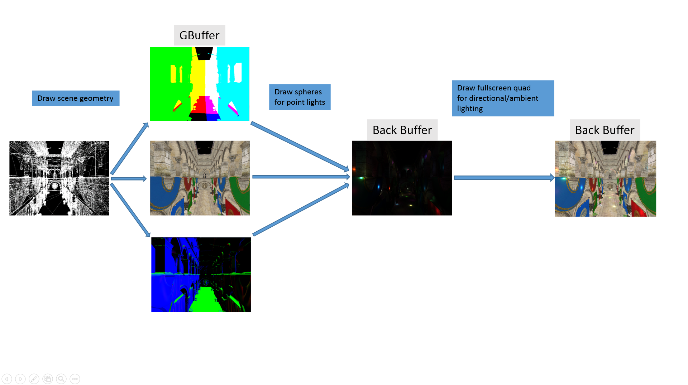
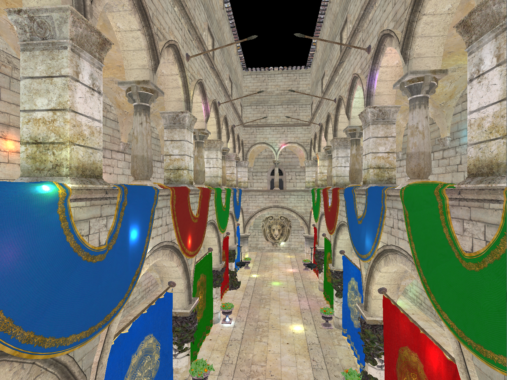
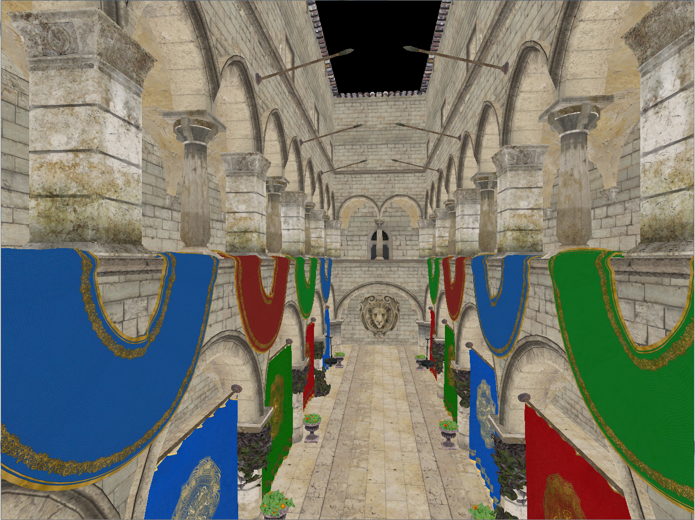
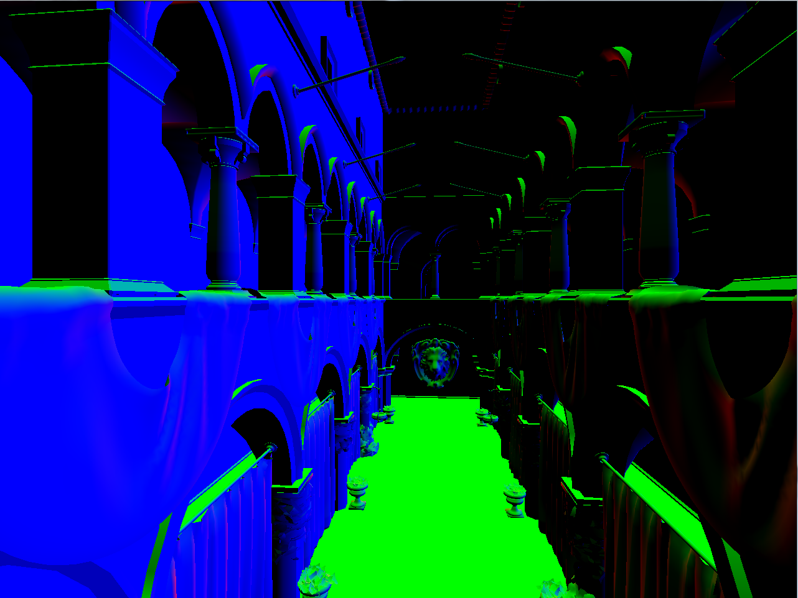
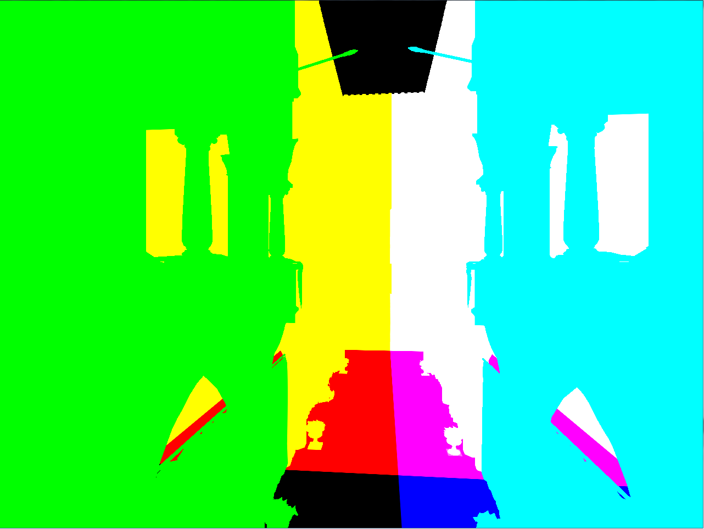
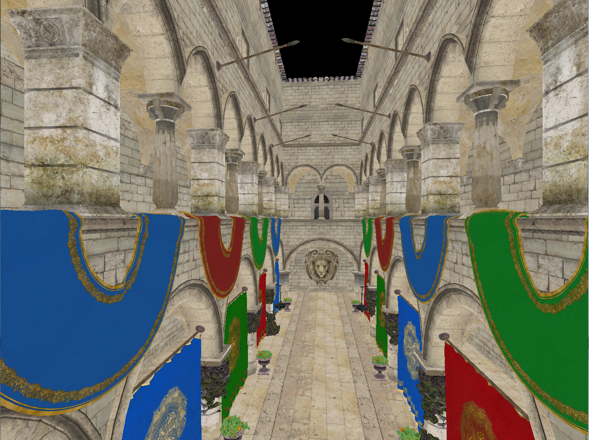
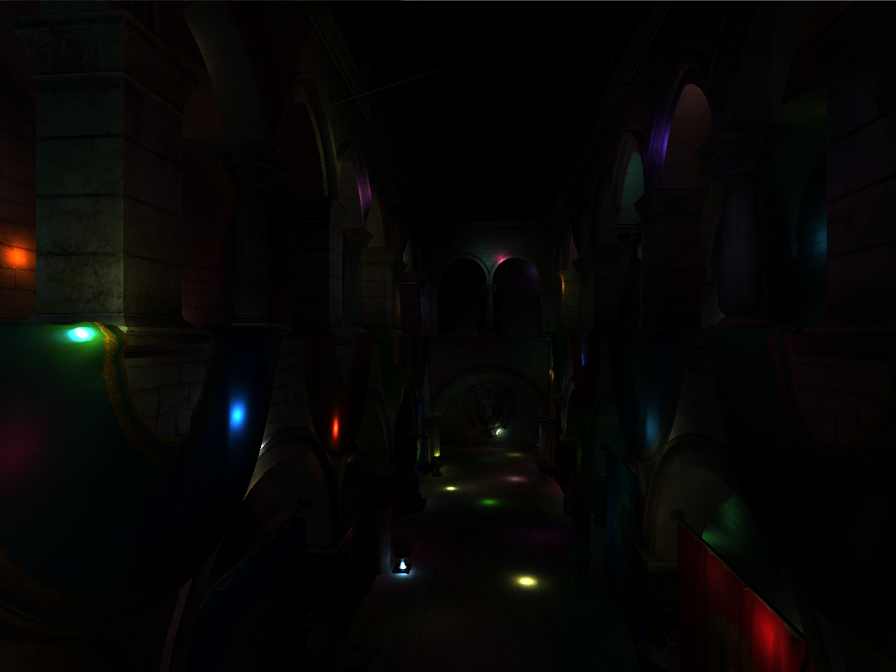
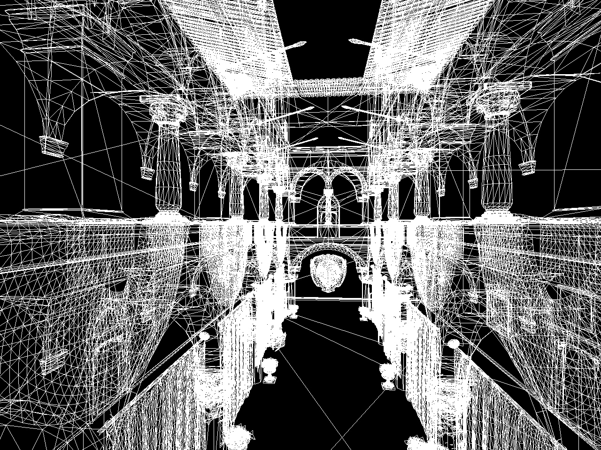

# GLApp #

An old toy project to experiment with OpenGL programming.
Currently there is a sample scene demonstrating an unoptimized deferred rendering pipeline. This project was used for internal company talk about deferred rendering.

# Build instructions #

There is a **Microsoft Visual Studio 2010** project included in the repository. The only external dependency is boost, which is not included in this repo.
The **Visual Studio** project requires an environment variable **BOOST_ROOT** to be present which points to the root folder of a boost installation. **Boost 1_51_0** is known to work but newer versions should work with minimal effort.

## Sample application screenshots ##

